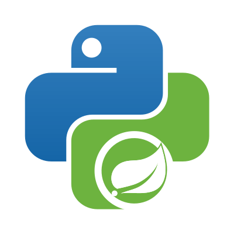
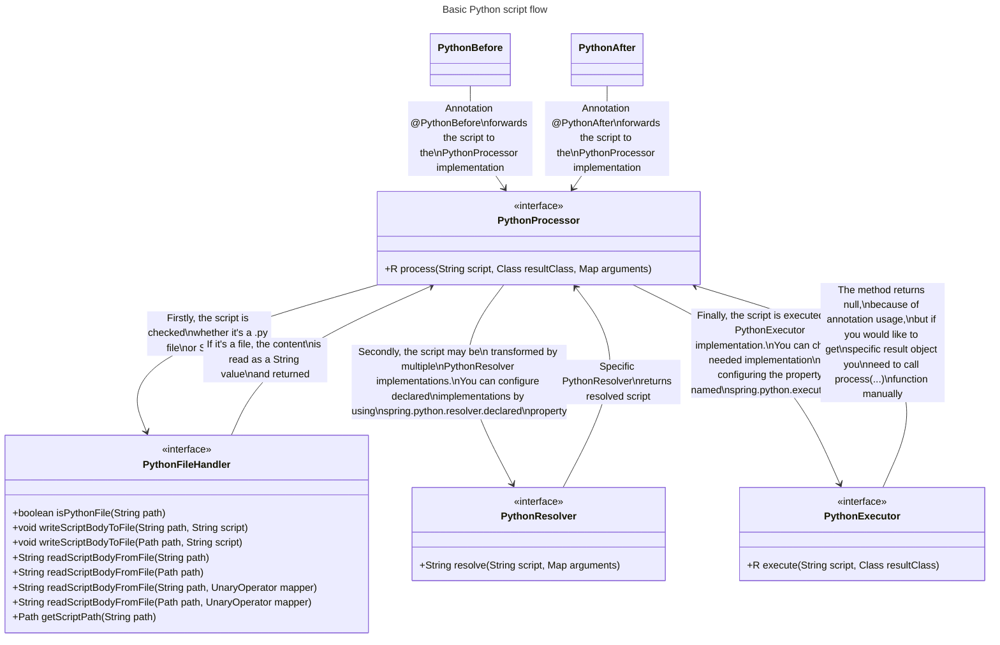

# 🐍 Spring Boot Python Executor



[](https://central.sonatype.com/artifact/io.github.w4t3rcs/spring-boot-python-executor-starter)
[](https://opensource.org/licenses/MIT)
[](https://www.oracle.com/java/technologies/javase/jdk17-archive-downloads.html)
[](https://spring.io/projects/spring-boot)
[](https://www.python.org/downloads/)

<hr>

## 📋 Table of Contents

- [TL;DR](#-tldr)
- [Introduction](#-introduction)
- [Features & Architecture](#-features--architecture)
  - [Core Components](#core-components)
  - [Security](#security)
  - [Integration](#integration)
- [Installation and Setup](#-installation-and-setup)
- [Configuration](#-configuration)
  - [File Properties](#file-properties)
  - [Executor Properties](#executor-properties)
  - [Resolver Properties](#resolver-properties)
  - [Py4J Properties](#py4j-properties)
- [Execution Modes](#-execution-modes)
  - [Local Execution](#local-execution)
  - [REST Execution](#rest-execution)
  - [gRPC Execution](#grpc-execution)
- [Usage Examples](#-usage-examples)
  - [Simple Example: Basic Calculation](#basic-examples)
  - [Realistic Example: Integration with Business Logic](#advanced-examples)
- [Python Server](#-python-server)
  - [REST Server](#rest-server)
  - [gRPC Server](#grpc-server)
  - [Environment Variables](#environment-variables)
- [Requirements](#-requirements)
- [License](#-license)
- [Contributing and Feedback](#-contributing-and-feedback)
  - [Reporting Issues](#reporting-issues)
  - [Feature Requests](#feature-requests)

<hr>

## 🚀 TL;DR

- **Execute Python scripts** securely from your Spring Boot applications
- Use **annotations** or direct API calls with **SpEL integration**
- Supports **local execution**, **REST API**, and **gRPC** communication modes
- Built-in security with **RestrictedPython**
- [Jump to Quick Start](#-installation-and-setup)

## 📝 Introduction

**Spring Boot Python Executor** is a library that enables secure and extensible execution of Python scripts from Java applications built with Spring Boot. It bridges the gap between Java and Python ecosystems, allowing developers to leverage Python's strengths while maintaining the robustness of Spring Boot applications.

This library is designed for Spring Boot developers who need to integrate Python functionality (like data processing, machine learning algorithms, or specialized libraries) into their Java applications without the complexity of manual process management.

## 🏗️ Features & Architecture

Spring Boot Python Executor provides a flexible architecture for executing Python code from Java:

### Core Components

- **PythonExecutor**: Interface for executing Python scripts with three implementations:
  - Local execution (in-process)
  - REST-based execution (separate container)
  - gRPC-based execution (separate container)
- **PythonResolver**: Processes scripts before execution, supporting:
  - SpEL integration for accessing Java variables
  - RestrictedPython for secure execution
  - Result resolution for capturing Python output
- **PythonProcessor**: Connects resolvers and executors



### Security

The library uses RestrictedPython to create a sandboxed environment for Python execution, preventing potentially harmful operations while allowing controlled script execution.

### Integration

- **AOP Support**: Execute Python before/after Java methods using annotations
- **SpEL Integration**: Access Java variables in Python code using SpEL expressions

## 📦 Installation and Setup

### Maven

Add the starter dependency to your `pom.xml`:

```xml
<dependency>
    <groupId>io.github.w4t3rcs</groupId>
    <artifactId>spring-boot-python-executor-starter</artifactId>
    <version>1.0.0</version>
</dependency>
```

### Gradle

Add the starter dependency to your `build.gradle`:

```groovy
implementation 'io.github.w4t3rcs:spring-boot-python-executor-starter:1.0.0'
```


## ⚙️ Configuration

### File Properties

| Property                       | Description                          | Default  | Required |
|--------------------------------|--------------------------------------|----------|----------|
| `spring.python.file.path`      | Base path for Python script files    | /python/ | No       |
| `spring.python.file.cacheable` | Whether to cache Python script files | true     | No       |

### Executor Properties

| Property                      | Description                          | Default | Required |
|-------------------------------|--------------------------------------|---------|----------|
| `spring.python.executor.type` | Execution mode: local, rest, or grpc | local   | Yes      |


#### Local Executor Properties

| Property                                     | Description                  | Default | Required |
|----------------------------------------------|------------------------------|---------|----------|
| `spring.python.executor.local.start-command` | Command to start Python      | python  | No       |
| `spring.python.executor.local.loggable`      | Whether to log Python output | true    | No       |

#### REST Executor Properties

| Property                               | Description               | Default                                                                          | Required |
|----------------------------------------|---------------------------|----------------------------------------------------------------------------------|----------|
| `spring.python.executor.rest.host`     | REST server host          | http://localhost                                                                 | No       |
| `spring.python.executor.rest.port`     | REST server port          | 8000                                                                             | No       |
| `spring.python.executor.rest.username` | Authentication username   | -                                                                                | Yes      |
| `spring.python.executor.rest.password` | Authentication password   | -                                                                                | Yes      |
| `spring.python.executor.rest.uri`      | Full URI to REST endpoint | `${spring.python.executor.rest.host}:${spring.python.executor.rest.port}/script` | No       |

#### gRPC Executor Properties

| Property                               | Description              | Default                                                                   | Required |
|----------------------------------------|--------------------------|---------------------------------------------------------------------------|----------|
| `spring.python.executor.grpc.host`     | gRPC server host         | localhost                                                                 | No       |
| `spring.python.executor.grpc.port`     | gRPC server port         | 50051                                                                     | No       |
| `spring.python.executor.grpc.username` | Authentication username  | -                                                                         | Yes      |
| `spring.python.executor.grpc.password` | Authentication password  | -                                                                         | Yes      |
| `spring.python.executor.grpc.uri`      | Full URI to gRPC service | `${spring.python.executor.grpc.host}:${spring.python.executor.grpc.port}` | No       |

### Resolver Properties

#### Core Resolver Properties

| Property                          | Description                                                   | Default          | Required |
|-----------------------------------|---------------------------------------------------------------|------------------|----------|
| `spring.python.resolver.declared` | Enabled resolvers: result, spelython, py4j, restricted_python | spelython,result | Yes      |

#### Result Resolver Properties

| Property                                            | Description                                    | Default       | Required |
|-----------------------------------------------------|------------------------------------------------|---------------|----------|
| `spring.python.resolver.result.regex`               | Regular expression to match result expressions | o4java\\{.+?} | No       |
| `spring.python.resolver.result.appearance`          | Variable name for results                      | r4java        | No       |
| `spring.python.resolver.result.position-from-start` | Position from start of match for extraction    | 7             | No       |
| `spring.python.resolver.result.position-from-end`   | Position from end of match for extraction      | 1             | No       |

#### Spelython Resolver Properties

| Property                                                     | Description                                  | Default     | Required |
|--------------------------------------------------------------|----------------------------------------------|-------------|----------|
| `spring.python.resolver.spelython.regex`                     | Regular expression to match SpEL expressions | spel\\{.+?} | No       |
| `spring.python.resolver.spelython.spel.local-variable-index` | Prefix for local variables in SpEL           | #           | No       |
| `spring.python.resolver.spelython.spel.position-from-start`  | Position from start of match for extraction  | 5           | No       |
| `spring.python.resolver.spelython.spel.position-from-end`    | Position from end of match for extraction    | 1           | No       |

#### Py4J Resolver Properties

| Property                                  | Description                 | Default                                   | Required |
|-------------------------------------------|-----------------------------|-------------------------------------------|----------|
| `spring.python.resolver.py4j.import-line` | Import statement for Py4J   | from py4j.java_gateway import JavaGateway | No       |
| `spring.python.resolver.py4j.gateway`     | Gateway initialization code | gateway = JavaGateway()                   | No       |

#### Restricted Python Resolver Properties

| Property                                                          | Description                                   | Default                                                                                         | Required |
|-------------------------------------------------------------------|-----------------------------------------------|-------------------------------------------------------------------------------------------------|----------|
| `spring.python.resolver.restricted-python.import-line`            | Import statements for RestrictedPython        | from RestrictedPython import compile_restricted<br>from RestrictedPython import safe_globals    | No       |
| `spring.python.resolver.restricted-python.code-variable-name`     | Variable name for source code                 | source_code                                                                                     | No       |
| `spring.python.resolver.restricted-python.local-variables-name`   | Variable name for local variables             | execution_result                                                                                | No       |
| `spring.python.resolver.restricted-python.safe-result-appearance` | Variable name for safe results                | r4java_restricted                                                                               | No       |
| `spring.python.resolver.restricted-python.script-imports-regex`   | Regular expression to match import statements | (^import [\\w.]+$)\|(^from [\\w.]+ import [\\w.]+$)\|(^from [\\w.]+ import [\\w.]+ as [\\w.]+$) | No       |
| `spring.python.resolver.restricted-python.print-enabled`          | Whether to enable print functionality         | true                                                                                            | No       |

### Py4J Properties

| Property                             | Description                                       | Default   | Required |
|--------------------------------------|---------------------------------------------------|-----------|----------|
| `spring.python.py4j.enabled`         | Whether to enable Py4J                            | false     | No       |
| `spring.python.py4j.host`            | Py4J server host                                  | 127.0.0.1 | No       |
| `spring.python.py4j.port`            | Py4J server port                                  | 25333     | No       |
| `spring.python.py4j.python-port`     | Py4J Python port                                  | 25334     | No       |
| `spring.python.py4j.connect-timeout` | Connection timeout in milliseconds (0 = infinite) | 0         | No       |
| `spring.python.py4j.read-timeout`    | Read timeout in milliseconds (0 = infinite)       | 0         | No       |
| `spring.python.py4j.loggable`        | Whether to log Py4J operations                    | true      | No       |

#### Enabling Py4J Gateway Server

The Py4J Gateway Server enables direct communication between Java and Python. You can enable it in two ways:

#### Using the `@EnablePy4J` annotation on a configuration class:

```java
@EnablePy4J
@Configuration
public class MyConfig {
    // Configuration code
}
```

#### Setting the `spring.python.py4j.enabled` property to `true` in your application properties:

```yaml
spring:
  python:
    py4j:
      enabled: true
```

When enabled, a Py4J Gateway Server will be started automatically, allowing your Python code to call Java methods directly.

## 🔄 Execution Modes

### Local Execution

Execute Python scripts in a local process on the same machine as your Java application.

### REST Execution

Execute Python scripts via REST API in a separate container.

### gRPC Execution

Execute Python scripts via gRPC in a separate container for better performance.

## 🐍 Python Server

### REST Server

The REST server provides an HTTP endpoint for executing Python scripts.

#### Running with Docker

```bash
docker run -p 8000:8000 \
  -e PYTHON_SERVER_USERNAME=<your-username> \
  -e PYTHON_SERVER_PASSWORD=<your-password> \
  w4t3rcs/spring-boot-python-executor-python-rest-server
```

#### Testing with curl

```bash
curl -X POST http://localhost:8000/script \
  -H "Content-Type: application/json" \
  -H "X-Username: <your-username>" \
  -H "X-Password: <your-password>" \
  -d '{\"script": \"r4java = 2 + 2\"}'
```

### gRPC Server

The gRPC server provides a high-performance interface for executing Python scripts.

#### Running with Docker

```bash
docker run -p 50051:50051 \
  -e PYTHON_SERVER_USERNAME=<your-username> \
  -e PYTHON_SERVER_PASSWORD=<your-password> \
  w4t3rcs/spring-boot-python-executor-python-grpc-server
```

#### Testing with grpcurl

```bash
grpcurl -plaintext -d '{\"script": \"r4java = 2 + 2\"}' \
  -H 'x-username: <your-username>' \
  -H 'x-password: <your-password>' \
  localhost:50051 PythonService/SendCode
```

### Environment Variables

| Variable                                | Description                | Default                    | Server    |
|-----------------------------------------|----------------------------|----------------------------|-----------|
| `PYTHON_SERVER_USERNAME`                | Authentication username    | -                          | Both      |
| `PYTHON_SERVER_PASSWORD`                | Authentication password    | -                          | Both      |
| `PYTHON_SERVER_HOST`                    | Server bind address        | 0.0.0.0                    | Both      |
| `PYTHON_SERVER_PORT`                    | Server port                | 8000 (REST) / 50051 (gRPC) | Both      |
| `PYTHON_SERVER_THREAD_POOL_MAX_WORKERS` | Max worker threads         | 10                         | gRPC only |
| `PYTHON_RESULT_APPEARANCE`              | Result variable name       | r4java                     | Both      |
| `PYTHON_ADDITIONAL_IMPORTS`             | Additional Python packages | -                          | Both      |
| `PYTHON_ADDITIONAL_IMPORTS_DELIMITER`   | Delimiter for imports      | ,                          | Both      |

#### PYTHON_ADDITIONAL_IMPORTS

This environment variable allows you to specify additional Python packages to install in the server container. For example, setting `PYTHON_ADDITIONAL_IMPORTS=numpy,pandas,scikit-learn` will install these packages when the container starts, making them available for your Python scripts.

## 💻 Usage Examples

### Basic Examples

#### Using Annotations

Spring Boot Python Executor provides annotations for executing Python code before or after a Java method:

```java
@Service
@RequiredArgsConstructor
public class ExampleService {
    // Execute Python code before the Java method
    @PythonBefore("print(spel{#name} + ' ' + spel{#surname})")
    public void executeBefore(String name, @PythonParam("surname") String lastName) {
        System.out.println("Hello from Java after Python: " + name + " : " + lastName);
    }
    
    // Execute Python code from a file
    @PythonBefore("example.py")
    public void executeFromFile(String name) {
        System.out.println("Hello from Java after Python file: " + name);
    }
    
    // Execute Python code after the Java method
    // The method's return value is available as #result
    @PythonAfter("print(spel{#result} + ' ' + spel{#name} + ' ' + spel{#sur})")
    public String executeAfter(String name, @PythonParam("sur") String surname) {
        System.out.println("Hello from Java before Python: " + name + " : " + surname);
        return "Python app is greeting you:";
    }
}
```

#### Direct Use of PythonProcessor

For more control, you can directly use the `PythonProcessor`:

```java
@Service
@RequiredArgsConstructor
public class CalculationService {
    private final PythonProcessor pythonProcessor;
    
    public Integer add(int a, int b) {
        String script = """
                # Simple addition in Python
                result = spel{#a} + spel{#b}
                o4java{result}  # This value will be returned to Java
                """;
        Map<String, Object> arguments = Map.of("a", a, "b", b);
        return pythonProcessor.process(script, Integer.class, arguments);
    }
}
```

### Advanced Examples

#### Integration with Business Logic

```java
@Service
@RequiredArgsConstructor
public class PricingService {
    private final PythonProcessor pythonProcessor;
    
    public double calculatePrice(Product product, Customer customer) {
        String script = """
                # Complex pricing algorithm in Python
                base_price = spel{#product.basePrice}
                discount = 0
                
                # Apply customer loyalty discount
                if spel{#customer.loyaltyYears} > 2:
                    discount += 0.05
                
                # Apply volume discount
                if spel{#product.quantity} > 10:
                    discount += 0.03
                
                final_price = base_price * (1 - discount)
                o4java{final_price}  # Return the calculated price to Java
                """;
        
        Map<String, Object> arguments = Map.of(
            "product", product,
            "customer", customer
        );
        
        return pythonProcessor.process(script, Double.class, arguments);
    }
}
```

#### Machine Learning Integration

This example demonstrates how to use Python's machine learning libraries from Java.
Note that if you use `python-rest-server` or `python-grpc-server` you'll need to set the `PYTHON_ADDITIONAL_IMPORTS` environment variable when running the Python server to make these libraries available.

```java
@Service
@RequiredArgsConstructor
public class SentimentAnalysisService {
    private final PythonProcessor pythonProcessor;
    
    public double analyzeSentiment(String text) {
        String script = """
                from sklearn.feature_extraction.text import CountVectorizer
                import numpy as np
                
                # Simple sentiment analysis using predefined positive and negative words
                positive_words = ['good', 'great', 'excellent', 'amazing', 'wonderful', 'best', 'love']
                negative_words = ['bad', 'terrible', 'awful', 'worst', 'hate', 'poor', 'disappointing']
                
                # Get the input text from Java
                text = spel{#text}.lower()
                
                # Count positive and negative words
                positive_count = sum(1 for word in positive_words if word in text)
                negative_count = sum(1 for word in negative_words if word in text)
                
                # Calculate sentiment score (-1 to 1)
                total = positive_count + negative_count
                if total == 0:
                    sentiment = 0
                else:
                    sentiment = (positive_count - negative_count) / total
                
                # Return the sentiment score to Java
                o4java{sentiment}
                """;
        
        Map<String, Object> arguments = Map.of("text", text);
        
        return pythonProcessor.process(script, Double.class, arguments);
    }
}
```

To run this example with the Python server, you would need to include the required libraries:

```bash
docker run -p 8000:8000 \
  -e PYTHON_SERVER_USERNAME=user \
  -e PYTHON_SERVER_PASSWORD=pass \
  -e PYTHON_ADDITIONAL_IMPORTS=scikit-learn,numpy,scipy \
  w4t3rcs/spring-boot-python-executor-python-rest-server
```

## 📋 Requirements

- Java 17+
- Spring Boot 3.5.3+
- Python 3.10+ (for local execution or server containers)
- Docker (for REST/gRPC backend)

## 📄 License

This project is licensed under the [MIT License](LICENSE).

## 🤝 Contributing and Feedback

### Reporting Issues

If you encounter any issues or have suggestions for improvements, please create an issue in the GitHub repository.

### Feature Requests

For feature requests, please create an issue with a detailed description of the proposed feature and its use cases.